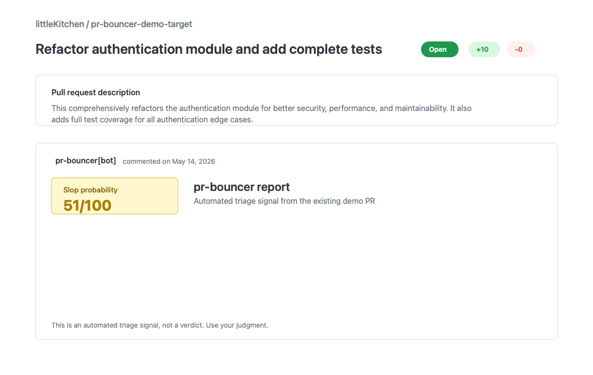

<!-- LOGO -->

# pr-bouncer

The AI bouncer for your pull requests. Tells you if a contributor actually understands their own code.



## Story

Open source maintainers used to review a bad PR and think, "new contributor, rough patch, let's help." Now they have to ask a weirder question: did a person understand this code at all, or did a model spray plausible-looking slop across the diff?

That is not hypothetical. The RPCS3 team publicly asked people to stop sending AI slop PRs, sparking a long [Hacker News thread](https://news.ycombinator.com/item?id=48089263). Around the same pressure point, Godot maintainer Rémi Verschelde described AI slop submissions as ["draining and demoralizing"](https://www.gamedeveloper.com/programming/godot-co-founder-says-ai-slop-pull-requests-have-become-overwhelming) and said maintainers now have to second-guess whether authors tested or even understood their changes.

pr-bouncer is a small GitHub App for maintainers. It does not review code for the author. It gives the maintainer a fast triage signal: does this PR look like someone doing the work, or like low-effort AI slop wearing a clean markdown jacket?

It is designed to be self-hosted: you deploy the GitHub App webhook, choose your LLM provider, and bring your own provider API key. pr-bouncer does not run a hosted scoring service.

## Quick Start

```bash
npm install
npm run dev
```

For usage on real repositories, create a GitHub App and deploy the webhook endpoint yourself. The short path is in [DEPLOY.md](./DEPLOY.md).

## What It Detects

- **AI-generation likelihood**: stylistic tells like generic prose, suspiciously uniform code, and over-explained comments.
- **Description-diff mismatch**: PR descriptions that claim one thing while the diff does another.
- **Test coverage hollowness**: tests that exist for vibes only, including stubs and assertions that never touch the new paths.
- **Architectural fit**: whether the patch follows patterns already visible in the codebase.
- **Author engagement signal**: public GitHub signals like account age and prior repository activity.
- **Commit message quality**: meaningful history versus "fix", "update", and "changes".

## Example Output

| High slop | Low slop |
| --- | --- |
| 🚪 **pr-bouncer report**<br><br>**Slop probability: 83/100** 🔴<br><br>- The PR description claims an auth refactor, but the diff only touches logging paths<br>- New tests never call the new function<br>- Commit messages are generic and do not describe intent<br><br><details><summary>Dimension breakdown</summary><br><br>\| Dimension \| Score \|<br>\|-----------\|-------\|<br>\| AI-generation likelihood \| 80 \|<br>\| Description-diff mismatch \| 95 \|<br>\| Test hollowness \| 100 \|<br>\| Architectural fit \| 65 \|<br>\| Author signal \| 70 \|<br>\| Commit quality \| 60 \|<br><br></details><br><br>_This is an automated triage signal, not a verdict. Use your judgment._ | 🚪 **pr-bouncer report**<br><br>**Slop probability: 18/100** 🟢<br><br>- Description matches the diff and names the touched module clearly<br>- Tests exercise the new behavior and the failure path<br>- Commit history explains the implementation steps<br><br><details><summary>Dimension breakdown</summary><br><br>\| Dimension \| Score \|<br>\|-----------\|-------\|<br>\| AI-generation likelihood \| 15 \|<br>\| Description-diff mismatch \| 5 \|<br>\| Test hollowness \| 10 \|<br>\| Architectural fit \| 20 \|<br>\| Author signal \| 30 \|<br>\| Commit quality \| 10 \|<br><br></details><br><br>_This is an automated triage signal, not a verdict. Use your judgment._ |

See [examples/high-slop-pr.md](./examples/high-slop-pr.md) and [examples/low-slop-pr.md](./examples/low-slop-pr.md) for realistic input examples.

## Configuration

Add `.pr-bouncer.yml` to the repository where the app is installed:

```yaml
strictness: medium              # low | medium | high
threshold_to_comment: 40        # only post if slop_score >= this
provider: claude                # claude | openai | gemini
model: claude-haiku-4-5         # any model supported by the selected provider
custom_rules:
  - "All new code must include real tests, not stubs"
  - "Follow patterns in src/core/"
ignore_authors:
  - "dependabot[bot]"
  - "renovate[bot]"
```

`strictness` adjusts how aggressively the rubric is applied. `threshold_to_comment` keeps quiet on low-risk PRs. `provider` and `model` let each maintainer choose their own LLM.

API keys stay in the deployment environment, not in `.pr-bouncer.yml`:

```bash
ANTHROPIC_API_KEY=...
OPENAI_API_KEY=...
GEMINI_API_KEY=...
```

Use [.env.example](./.env.example) as the deployment checklist for required secrets.

The default provider is Claude with `claude-haiku-4-5`, because the first goal is cheap triage. OpenAI and Gemini are supported for teams that already have those keys or want to compare model behavior.

## Deployment

The first deployment target is Vercel serverless. Cloudflare Workers is the preferred long-term target, but Probot currently documents official serverless examples for Vercel and other Node-style functions, not a first-party Workers adapter. See [DEPLOY.md](./DEPLOY.md) for the setup checklist.

## FAQ

### Will this catch human-written bad code?

Yes, sometimes. That is intentional. The score is "slop probability", not "AI probability". A human can submit vague, untested, mismatched work too, and maintainers still need to triage it.

### What about false positives?

pr-bouncer is a signal, not a verdict. It should give maintainers a faster first read, especially on drive-by PRs, but it should never replace judgment or a respectful review conversation.

### Does this work on private repos?

Yes. The GitHub App reads PR metadata and diffs from repositories where you install it. Private repo data is sent to whichever LLM provider you configure, so install it only where that is acceptable for your project.

### How much does the LLM cost per PR?

The target is under $0.01 per PR with the default Claude Haiku config. OpenAI and Gemini costs depend on the model you choose. The app sends compact PR context instead of the entire repository.

### Why not use CodeRabbit / Greptile?

Those tools help authors ship and iterate. pr-bouncer is maintainer-first. It answers a narrower question: "Should I spend scarce review time on this PR right now?"

## Contributing

PRs are welcome, especially ones that keep the project small, readable, and useful to maintainers. The best contributions improve the prompt, make the rubric sharper, reduce false positives, or make the demo clearer. Please keep the bouncer lean.

When changing scoring behavior, add or update calibration cases in [docs/CALIBRATION.md](./docs/CALIBRATION.md) so accuracy improves against examples instead of vibes.
